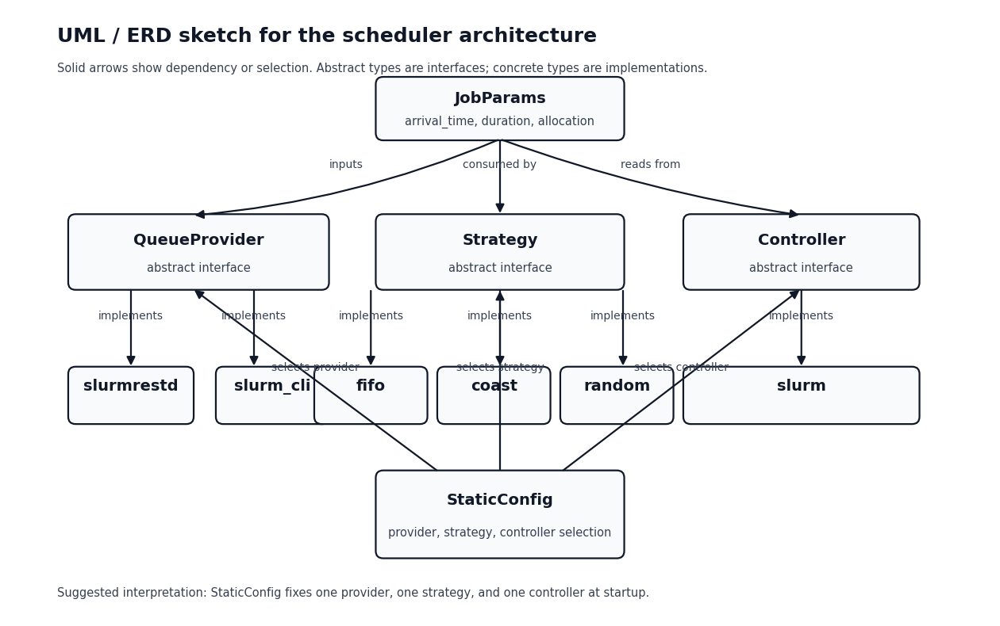

# SMART-DRI/CATS Multi-job API

Each job i ∈ Jk is characterized by

(a, r, d, e, D, m), each attribute has subscript i

Where

- a is the arrival slot of the job intent

- r is the resource demand → how is this obtained?

- d is the estimated runtime → replace with user provided runtime?

- e-hat is the estimated total energy consumption → derived from traces,
  cluster agent?

- D is the deadline

- m is the maximum acceptable waiting time

cost function = alpha . (carbon intensity \* energy) + beta . delay +
gamma . congestion

resource_demand_other(!i) = Background load (B) + resource demand of all
other jobs != i

congestion = congestion_potential(resource_demand_other(!i) + r) -
congestion_potential(resource_demand_other(!i))

congestion_potential = x =\> x\*x

Convergence through a game theoretic update.

**Responsibility/Information ownership - check if this makes sense!**

+-----------------------+-----------------------+-----------------------+
| *Slurm queue*         | *User*                | *Cluster operator*    |
+-----------------------+-----------------------+-----------------------+
| Background load (B)   | Arrival slot (a)      | Max waiting time (m)  |
|                       |                       | → could be user as    |
|                       |                       | well, but people      |
|                       |                       | might set very low    |
|                       |                       | limit -- optimal m?   |
+-----------------------+-----------------------+-----------------------+
| Energy consumption    | User provided runtime | Deadline (D)          |
| (e-hat) - average     | (d)                   |                       |
| energy usage of jobs  |                       |                       |
| in cluster?           |                       |                       |
+-----------------------+-----------------------+-----------------------+
|                       |                       | Scheduler params:     |
|                       |                       |                       |
|                       |                       | alpha: carbon coeff   |
|                       |                       |                       |
|                       |                       | beta: delay coeff     |
|                       |                       |                       |
|                       |                       | gamma: congestion     |
|                       |                       | coeff                 |
|                       |                       |                       |
|                       |                       | delta: discretization |
|                       |                       | for slots             |
|                       |                       |                       |
|                       |                       | Microbatch_size:      |
|                       |                       | periodicity of        |
|                       |                       | pulling from slurm    |
+=======================+=======================+=======================+

How should the cluster operator set alpha, beta, gamma - are there
heuristics?

{width="6.5in" height="4.069444444444445in"}

Need to add evals - Is there special cluster configuration that is
required to enable detailed logging? If so then we should document that.
